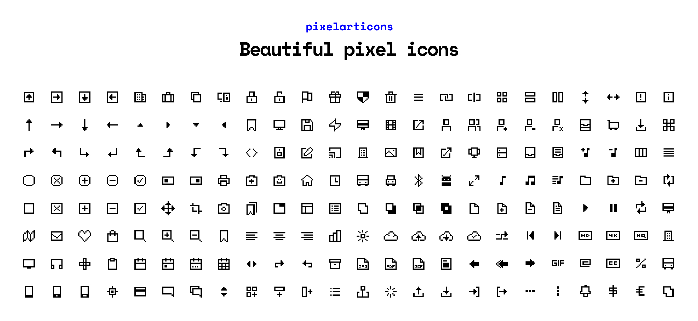

# Pixelarticons


359 careful handmade pixel art icons based on a 24x24 grid and `currentColor` fills. All icons were made individually using rectangles to recreate a non-anti-aliased look. It makes use of subtle padding for each icon. It is recommended to use the icons with a width and height of 24px, 48px, 72px, 96px because on all scales outside of 24px the icons will appear blurry.

## How to get the icons

- From the [🌐 Pixelarticons website](https://pixelarticons.com "Pixelarticons - Website")
- Duplicate the [🎨 Pixelarticons Figma file](https://www.figma.com/community/file/952542622393317653/Pixelarticons)
- Use them directly in your code: 👇
 
## Gettings Started
### Use any icons staticly from CDN
```html
<!-- get the file icon from unpkg -->


<!-- get the file icon from jsdelivr -->

```
### Install via package manager
```bash
npm i pixelarticons # or yarn add pixelarticons
```
```jsx
// import the file.svg icon directly
import File from "pixelarticons/svg/file.svg";
```
### Insert plain svg code

```html
<!-- the file.svg directly in html -->
<svg width="24" height="24" fill="none" xmlns="http://www.w3.org/2000/svg">
  <path d="M3 22h18V8h-2V6h-2v2h-2V6h2V4h-2V2H3v20zm2-2V4h8v6h6v10H5z" fill="currentColor" />
</svg>
```

## Current tasks

- [x] Figma file with components
- [x] Updating SVG source code for all icons
- [x] Convert all rectangles into SVG-paths
- [X] Make public Figma-file with icon library
- [ ] Add a new filled set
- [ ] Add a new 32x32 set
- [ ] Add brands and social media icons

## Where else to find?

- [Website](https://www.pixelarticons.com "Pixelarticons - Website")
- [Instagram](https://www.instagram.com/pixelarticons/ "Pixelarticons - Instagram")
- [NPM](https://www.npmjs.com/package/pixelarticons "Pixelarticons - Npm")
