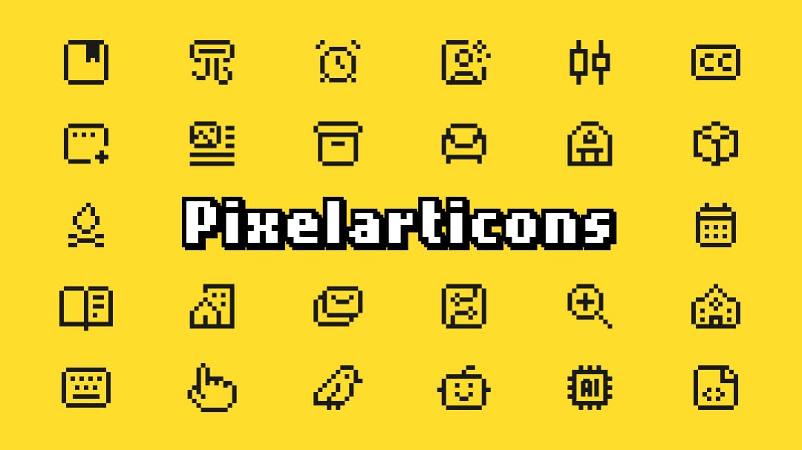

# Pixelarticons


486 carefully handmade pixel art icons based on a 24×24 grid using `fill="currentColor"`. Each icon is drawn on the pixel grid without anti-aliasing for a crisp, consistent look. Use at 24px, 48px, 72px, or 96px for best results — other sizes will appear blurry.

## Get the icons

- [🌐 Pixelarticons website](https://pixelarticons.com "Pixelarticons - Website")
- [🎨 Figma community file](https://www.figma.com/community/file/952542622393317653/Pixelarticons)
- Use them directly in your code: 👇

## Getting Started

### Install via package manager

```bash
npm i pixelarticons
```

### Use directly via unpkg

```html

```

Replace `file` with any icon name (e.g. `heart`, `arrow-left`, `add-box`).

### Generate webfonts

Outputs `.ttf`, `.woff`, `.woff2`, `.eot`, `.svg` fonts plus CSS/SCSS/React components into `./fonts/`:

```bash
npm run font
```

## Contributing

See [CONTRIBUTING.md](CONTRIBUTING.md) for design rules, naming conventions, and how to add new icons.

Useful commands when working on icons:

```bash
npm run validate   # check all SVGs against design rules
npm run browser    # preview all icons in a local HTML file
```

## Where to find us

- [Website](https://www.pixelarticons.com "Pixelarticons - Website")
- [Instagram](https://www.instagram.com/pixelarticons/ "Pixelarticons - Instagram")
- [NPM](https://www.npmjs.com/package/pixelarticons "Pixelarticons - NPM")
- [GitHub Issues](https://github.com/halfmage/pixelarticons/issues)
